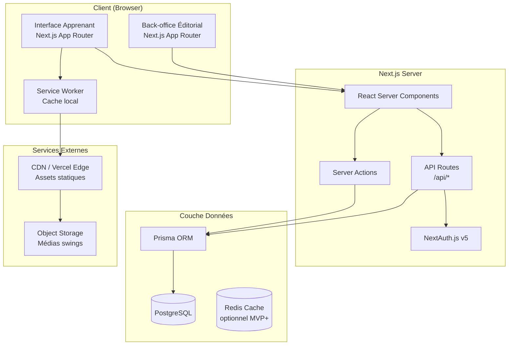
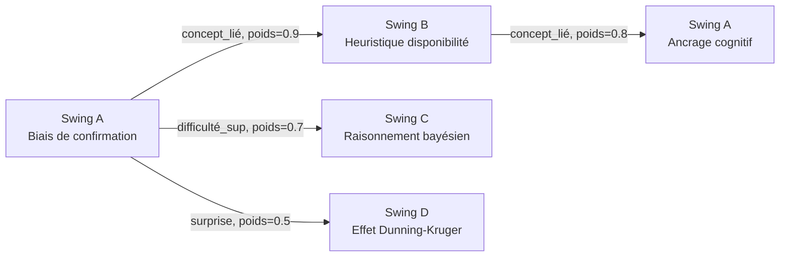
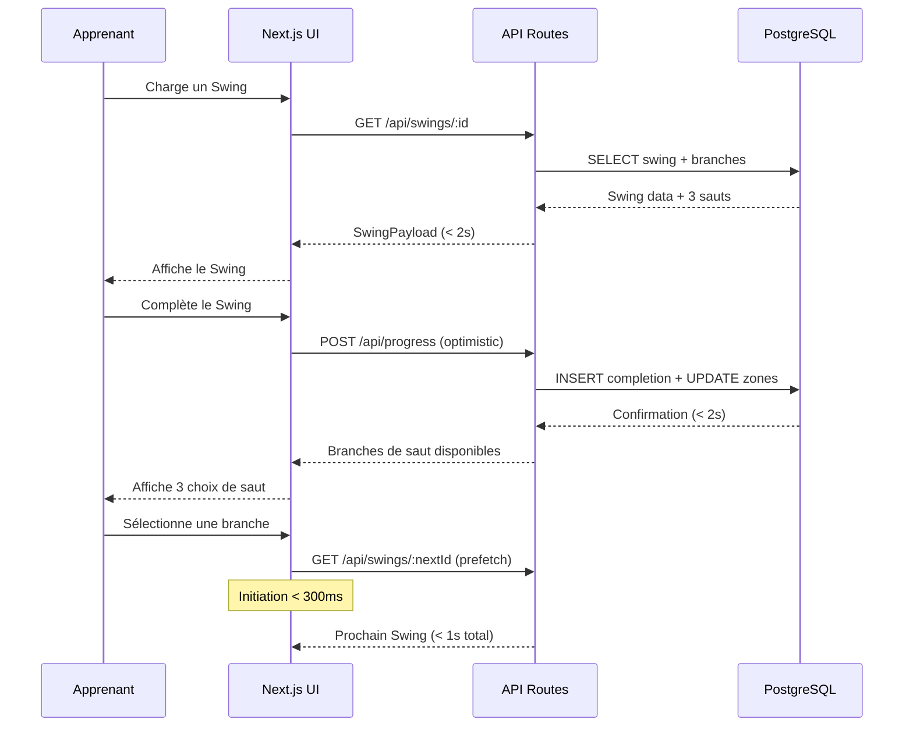

# Document de Design Technique — Gibbons Platform

## Vue d'ensemble

Gibbons est une plateforme de micro-apprentissage dont l'unité atomique est le **Swing** (1–3 minutes). La navigation entre swings — le **Saut** — est non-linéaire et exploratoire : l'apprenant choisit parmi 3 branches directionnelles à chaque transition. Le domaine MVP est "Penser mieux" (biais cognitifs, logique, décision, persuasion, heuristiques) avec 50 swings initiaux.

### Objectifs de design

- **Fluidité cognitive** : chaque transition doit être imperceptible (< 300 ms d'initiation, < 1 s de chargement complet).
- **Exploration spatiale** : la progression est représentée comme une canopée de zones, sans pourcentage.
- **Extensibilité éditoriale** : le back-office permet la création et publication de swings sans déploiement.
- **Scalabilité progressive** : architecture capable de passer de 50 swings (MVP) à des milliers (phase 3 UGC).

### Résumé des décisions techniques clés

| Décision | Choix | Rationale |
|---|---|---|
| Framework frontend | Next.js 15 (App Router) | SSR/SSG natif, React Server Components, déploiement Vercel |
| Base de données | PostgreSQL via Prisma ORM | Relations complexes, JSONB pour contenu flexible, transactions ACID |
| Authentification | NextAuth.js v5 (Auth.js) | Intégration native Next.js, support OAuth + credentials |
| Graphe de navigation | Modèle relationnel PostgreSQL + algorithme en mémoire | Suffisant pour MVP (50 swings), évolutif vers Neo4j si besoin |
| Temps réel | Server-Sent Events (SSE) | Mise à jour Score_Qualité sans WebSocket overhead |
| Tests de propriétés | fast-check + Vitest | Bibliothèque PBT mature pour TypeScript/JavaScript |
| Déploiement | Vercel (frontend) + Railway/Supabase (PostgreSQL) | Simplicité opérationnelle pour MVP |

---

## Architecture

### Vue d'ensemble architecturale



### Architecture de navigation (Graphe de Swings)

Le cœur de Gibbons est un **graphe orienté pondéré** où :
- Les **nœuds** sont les Swings
- Les **arêtes** sont les Sauts possibles, avec des métadonnées (type de relation, poids de pertinence)



**Algorithme de sélection des 3 branches** :
1. Récupérer tous les Sauts sortants du Swing courant (arêtes du graphe)
2. Filtrer les Swings déjà complétés par l'apprenant (sauf si aucune alternative)
3. Sélectionner au moins 2 axes différents parmi : `concept_lié`, `difficulté_différente`, `surprise`
4. Trier par score de pertinence (poids × facteur_fraîcheur)
5. Retourner exactement 3 branches (fallback vers zone dense adjacente si < 3 disponibles)

### Flux de données principal



---

## Composants et Interfaces

### Structure des composants frontend

```
src/
├── app/
│   ├── (learner)/              # Routes apprenant
│   │   ├── page.tsx            # Landing / entrée dans la canopée
│   │   ├── swing/[id]/
│   │   │   └── page.tsx        # Écran principal d'un Swing
│   │   └── canopy/
│   │       └── page.tsx        # Vue canopée (progression)
│   ├── (editorial)/            # Routes back-office
│   │   ├── dashboard/
│   │   │   └── page.tsx
│   │   └── swings/
│   │       ├── new/page.tsx    # Création d'un swing
│   │       └── [id]/edit/page.tsx
│   └── api/
│       ├── swings/
│       │   ├── route.ts        # GET (liste), POST (création)
│       │   └── [id]/
│       │       ├── route.ts    # GET, PUT, DELETE
│       │       └── branches/route.ts  # GET branches de saut
│       ├── progress/
│       │   └── route.ts        # POST completion, GET état
│       ├── votes/
│       │   └── route.ts        # POST vote
│       └── auth/
│           └── [...nextauth]/route.ts
├── components/
│   ├── swing/
│   │   ├── SwingScreen.tsx     # Conteneur principal (1 écran = 1 swing)
│   │   ├── SwingTypeA.tsx      # Insight rapide
│   │   ├── SwingTypeB.tsx      # Mini défi interactif
│   │   ├── SwingTypeC.tsx      # Application / exercice
│   │   ├── SwingTypeD.tsx      # Réflexion guidée
│   │   └── SwingMeta.tsx       # Durée, Score_Qualité, Créateur
│   ├── navigation/
│   │   ├── SautBranches.tsx    # Les 3 choix directionnels
│   │   └── BranchCard.tsx      # Carte d'une branche
│   └── canopy/
│       ├── CanopyView.tsx      # Vue spatiale de progression
│       └── ZoneIndicator.tsx   # Zones explorées/denses/inconnues
├── lib/
│   ├── db.ts                   # Client Prisma singleton
│   ├── navigation.ts           # Algorithme de sélection des branches
│   ├── scoring.ts              # Calcul Score_Qualité
│   └── auth.ts                 # Configuration NextAuth
└── types/
    └── index.ts                # Types TypeScript partagés
```

### Interfaces TypeScript principales

```typescript
// Types de base
type SwingType = 'TYPE_A' | 'TYPE_B' | 'TYPE_C' | 'TYPE_D';
type ZoneType = 'explored' | 'dense' | 'unknown';
type BranchRelationType = 'concept_lié' | 'difficulté_différente' | 'surprise';

// Swing complet
interface Swing {
  id: string;
  type: SwingType;
  title: string;
  content: SwingContent;       // JSONB — structure variable selon le type
  branchId: string;
  forestId: string;
  estimatedDuration: number;   // secondes
  creatorId: string;
  creatorLabel: string;
  qualityScore: number;        // 0.0 – 5.0
  isPublished: boolean;
  publishedAt: Date | null;
  createdAt: Date;
  updatedAt: Date;
}

// Contenu variable selon le type de swing
type SwingContent =
  | SwingContentTypeA   // { text: string; visualUrl: string; animationData: object }
  | SwingContentTypeB   // { problem: string; options: string[]; correctIndex: number; explanation: string }
  | SwingContentTypeC   // { prompt: string; inputType: 'text' | 'choice'; rubric: string }
  | SwingContentTypeD;  // { question: string; choices: string[]; anchorFeedback: string }

// Branche de saut
interface SwingBranch {
  targetSwingId: string;
  targetSwing: Pick<Swing, 'id' | 'title' | 'type' | 'estimatedDuration' | 'qualityScore'>;
  relationType: BranchRelationType;
  weight: number;              // 0.0 – 1.0, pertinence de la connexion
}

// Progression apprenant
interface LearnerProgress {
  learnerId: string;
  exploredSwingIds: string[];
  denseSwingIds: string[];
  lastSwingId: string | null;
  lastSessionAt: Date;
}

// Payload de l'écran Swing (réponse API)
interface SwingScreenPayload {
  swing: Swing;
  branches: SwingBranch[];     // Toujours exactement 3
  learnerZone: ZoneType;       // Zone du swing courant pour l'apprenant
}
```

### API Routes — Contrats

| Méthode | Route | Description | Auth |
|---|---|---|---|
| `GET` | `/api/swings/:id` | Récupère un swing + ses 3 branches | Apprenant |
| `POST` | `/api/swings` | Crée un nouveau swing (brouillon) | Créateur |
| `PUT` | `/api/swings/:id` | Modifie un swing non publié | Créateur |
| `POST` | `/api/swings/:id/publish` | Publie un swing (validation + mise en ligne) | Créateur |
| `GET` | `/api/swings/:id/branches` | Calcule les 3 branches pour un apprenant | Apprenant |
| `POST` | `/api/progress` | Enregistre la complétion d'un swing | Apprenant |
| `GET` | `/api/progress` | Récupère l'état de progression | Apprenant |
| `POST` | `/api/votes` | Soumet un vote sur un swing | Apprenant |

---

## Modèles de Données

### Schéma Prisma

```prisma
// schema.prisma

generator client {
  provider = "prisma-client-js"
}

datasource db {
  provider = "postgresql"
  url      = env("DATABASE_URL")
}

// ─── Taxonomie ───────────────────────────────────────────────────────────────

model Forest {
  id          String   @id @default(cuid())
  name        String   @unique          // ex: "Penser mieux"
  slug        String   @unique
  description String?
  branches    Branch[]
  createdAt   DateTime @default(now())
}

model Branch {
  id       String  @id @default(cuid())
  name     String                        // ex: "Biais de confirmation"
  slug     String
  forestId String
  forest   Forest  @relation(fields: [forestId], references: [id])
  swings   Swing[]

  @@unique([forestId, slug])
}

// ─── Swings ──────────────────────────────────────────────────────────────────

enum SwingType {
  TYPE_A
  TYPE_B
  TYPE_C
  TYPE_D
}

model Swing {
  id                String    @id @default(cuid())
  type              SwingType
  title             String
  content           Json                  // Structure variable selon le type
  estimatedDuration Int                   // Durée en secondes (60–180)
  branchId          String
  branch            Branch    @relation(fields: [branchId], references: [id])
  creatorId         String
  creator           User      @relation(fields: [creatorId], references: [id])
  isPublished       Boolean   @default(false)
  publishedAt       DateTime?
  qualityScore      Float     @default(0.0)
  voteCount         Int       @default(0)
  editorialScore    Float     @default(0.0)  // Score éditorial (0.0–5.0)
  createdAt         DateTime  @default(now())
  updatedAt         DateTime  @updatedAt

  // Relations graphe
  outgoingBranches  SwingEdge[] @relation("SourceSwing")
  incomingBranches  SwingEdge[] @relation("TargetSwing")

  // Progression
  completions       SwingCompletion[]
  votes             SwingVote[]

  @@index([branchId])
  @@index([isPublished])
}

// ─── Graphe de Navigation ────────────────────────────────────────────────────

enum BranchRelationType {
  CONCEPT_LIE
  DIFFICULTE_DIFFERENTE
  SURPRISE
}

model SwingEdge {
  id             String              @id @default(cuid())
  sourceSwingId  String
  targetSwingId  String
  relationType   BranchRelationType
  weight         Float               @default(1.0)  // 0.0–1.0
  sourceSwing    Swing               @relation("SourceSwing", fields: [sourceSwingId], references: [id])
  targetSwing    Swing               @relation("TargetSwing", fields: [targetSwingId], references: [id])
  createdAt      DateTime            @default(now())

  @@unique([sourceSwingId, targetSwingId])
  @@index([sourceSwingId])
}

// ─── Utilisateurs ────────────────────────────────────────────────────────────

enum UserRole {
  LEARNER
  CREATOR
  ADMIN
}

model User {
  id            String    @id @default(cuid())
  email         String    @unique
  name          String?
  role          UserRole  @default(LEARNER)
  isEditorial   Boolean   @default(false)  // Équipe éditoriale vs contributeur UGC
  createdAt     DateTime  @default(now())

  // NextAuth
  accounts      Account[]
  sessions      Session[]

  // Contenu
  swings        Swing[]

  // Progression
  progress      LearnerProgress?
  completions   SwingCompletion[]
  votes         SwingVote[]
}

// ─── Progression ─────────────────────────────────────────────────────────────

model LearnerProgress {
  id            String   @id @default(cuid())
  userId        String   @unique
  user          User     @relation(fields: [userId], references: [id])
  lastSwingId   String?
  lastSessionAt DateTime @default(now())
  updatedAt     DateTime @updatedAt
}

model SwingCompletion {
  id          String   @id @default(cuid())
  userId      String
  swingId     String
  completedAt DateTime @default(now())
  user        User     @relation(fields: [userId], references: [id])
  swing       Swing    @relation(fields: [swingId], references: [id])

  @@unique([userId, swingId])
  @@index([userId])
}

// ─── Votes et Score Qualité ───────────────────────────────────────────────────

model SwingVote {
  id        String   @id @default(cuid())
  userId    String
  swingId   String
  score     Int      // 1–5
  createdAt DateTime @default(now())
  user      User     @relation(fields: [userId], references: [id])
  swing     Swing    @relation(fields: [swingId], references: [id])

  @@unique([userId, swingId])
  @@index([swingId])
}

// ─── NextAuth ────────────────────────────────────────────────────────────────

model Account {
  id                String  @id @default(cuid())
  userId            String
  type              String
  provider          String
  providerAccountId String
  refresh_token     String? @db.Text
  access_token      String? @db.Text
  expires_at        Int?
  token_type        String?
  scope             String?
  id_token          String? @db.Text
  session_state     String?
  user              User    @relation(fields: [userId], references: [id], onDelete: Cascade)

  @@unique([provider, providerAccountId])
}

model Session {
  id           String   @id @default(cuid())
  sessionToken String   @unique
  userId       String
  expires      DateTime
  user         User     @relation(fields: [userId], references: [id], onDelete: Cascade)
}

model VerificationToken {
  identifier String
  token      String   @unique
  expires    DateTime

  @@unique([identifier, token])
}
```

### Calcul du Score_Qualité

Le `Score_Qualité` est une moyenne pondérée :

```
Score_Qualité = (moyenne_votes × 0.7) + (score_éditorial × 0.3)
```

- `moyenne_votes` : moyenne des votes apprenants (1–5), normalisée sur 5
- `score_éditorial` : note attribuée par l'équipe éditoriale (0–5)
- Mise à jour déclenchée à chaque nouveau vote via Server Action

### Représentation des zones (Canopée)

Les zones sont calculées dynamiquement à partir de `SwingCompletion` :

```typescript
// lib/zones.ts
function computeZones(
  allSwings: string[],
  completedIds: string[],
  graph: Map<string, string[]>  // adjacency list
): { explored: string[]; dense: string[]; unknown: string[] } {
  const explored = new Set(completedIds);
  const dense = new Set<string>();

  // Zone dense = swings non complétés adjacents aux zones explorées
  for (const swingId of explored) {
    const neighbors = graph.get(swingId) ?? [];
    for (const neighbor of neighbors) {
      if (!explored.has(neighbor)) {
        dense.add(neighbor);
      }
    }
  }

  const unknown = allSwings.filter(
    (id) => !explored.has(id) && !dense.has(id)
  );

  return {
    explored: [...explored],
    dense: [...dense],
    unknown,
  };
}
```

---

## Propriétés de Correction

*Une propriété est une caractéristique ou un comportement qui doit rester vrai pour toutes les exécutions valides d'un système — essentiellement, un énoncé formel de ce que le système doit faire. Les propriétés servent de pont entre les spécifications lisibles par l'humain et les garanties de correction vérifiables par machine.*

### Propriété 1 : Sélection des branches de saut

*Pour tout* graphe de swings valide et tout apprenant, l'algorithme `selectBranches` doit retourner exactement 3 branches distinctes lorsque le graphe en contient au moins 3, ou le nombre maximum disponible sinon — et dans tous les cas au moins 1 branche (issue de la zone dense adjacente si aucune branche directe n'existe).

**Valide : Requirements 2.1, 2.5**

### Propriété 2 : Diversité des axes de branche

*Pour tout* résultat de `selectBranches` contenant 3 branches, les `relationType` des branches retournées doivent couvrir au moins 2 valeurs distinctes parmi `CONCEPT_LIE`, `DIFFICULTE_DIFFERENTE` et `SURPRISE`.

**Valide : Requirements 2.2**

### Propriété 3 : Exclusion des swings déjà complétés

*Pour tout* apprenant ayant au moins un swing complété et pour tout graphe offrant des alternatives non complétées, aucune des branches retournées par `selectBranches` ne doit pointer vers un swing présent dans les completions de cet apprenant.

**Valide : Requirements 2.6**

### Propriété 4 : Invariant de zone après complétion

*Pour tout* apprenant et tout swing, après l'appel à `recordCompletion(userId, swingId)`, la fonction `computeZones()` doit placer ce swing dans `explored` et l'exclure de `dense` et `unknown`.

**Valide : Requirements 4.1, 4.3**

### Propriété 5 : Partition des zones (cohérence)

*Pour tout* état de progression d'un apprenant et tout ensemble de swings publiés, les ensembles `explored`, `dense` et `unknown` calculés par `computeZones()` doivent être deux à deux disjoints et leur union doit couvrir exactement l'ensemble de tous les swings publiés.

**Valide : Requirements 4.1, 4.4**

### Propriété 6 : Calcul borné du Score_Qualité

*Pour tout* ensemble de votes apprenants (scores entiers entre 1 et 5) et tout score éditorial (réel entre 0.0 et 5.0), la fonction `computeQualityScore()` doit retourner une valeur dans l'intervalle [0.0, 5.0] respectant la formule `(moyenne_votes × 0.7) + (score_éditorial × 0.3)`.

**Valide : Requirements 7.1, 7.3**

### Propriété 7 : Validation de publication (double sens)

*Pour tout* swing soumis à la publication avec tous les champs obligatoires (type, titre, contenu, branche, durée estimée) correctement renseignés, `validateSwing()` doit retourner `success = true`. Inversement, *pour tout* sous-ensemble non vide de champs obligatoires manquants, `validateSwing()` doit retourner `success = false` avec la liste exacte des champs manquants, sans créer d'entrée en base.

**Valide : Requirements 5.2, 5.3**

### Propriété 8 : Round-trip de la progression

*Pour tout* apprenant et tout ensemble de swings complétés, après persistance via `saveProgress(userId, completions)` et rechargement via `loadProgress(userId)`, l'état restauré doit contenir exactement les mêmes swings complétés que l'état initial.

**Valide : Requirements 6.1, 6.2, 6.3**

### Propriété 9 : Métadonnées affichées sur chaque swing

*Pour tout* swing valide (avec `estimatedDuration`, `qualityScore` et `creatorLabel` définis), le composant `SwingMeta` doit afficher ces trois informations dans son rendu, et le rendu de `CanopyView` ne doit contenir aucun texte correspondant à un pourcentage de complétion global (pattern `\d+\s*%`).

**Valide : Requirements 1.6, 3.5, 4.2, 7.2**

### Propriété 10 : Invariants de création d'un swing

*Pour tout* swing créé avec des données valides, le swing persisté doit avoir exactement un type parmi `TYPE_A`, `TYPE_B`, `TYPE_C`, `TYPE_D`, et son `branchId` doit référencer une branche existante appartenant à une forêt existante.

**Valide : Requirements 3.3, 3.4**

---

## Gestion des Erreurs

### Stratégie globale

```typescript
// types/errors.ts
type GibbonsError =
  | { code: 'SWING_NOT_FOUND'; swingId: string }
  | { code: 'NO_BRANCHES_AVAILABLE'; swingId: string }
  | { code: 'PROGRESS_PERSIST_FAILED'; userId: string; swingId: string }
  | { code: 'SWING_LOAD_TIMEOUT'; swingId: string; elapsed: number }
  | { code: 'VALIDATION_ERROR'; fields: string[] }
  | { code: 'UNAUTHORIZED' }
  | { code: 'SWING_ALREADY_PUBLISHED'; swingId: string };
```

### Cas d'erreur critiques

**Échec de persistance de progression (Req. 6.4)**
- Stratégie : optimistic update côté client + retry automatique (3 tentatives, backoff exponentiel)
- Fallback : stockage local (`localStorage`) avec synchronisation au prochain chargement
- Notification : toast non-bloquant "Sauvegarde en attente..."

**Chargement d'un swing > 5 secondes (Req. 8.4)**
- Stratégie : timeout côté client avec `AbortController`
- Fallback : affichage d'un indicateur de chargement + bouton "Revenir à la sélection"
- Logging : événement envoyé pour monitoring

**Aucune branche de saut disponible (Req. 2.5)**
- Stratégie : fallback vers les swings de la zone dense adjacente
- Si zone dense vide : proposer le swing de départ de la forêt
- Jamais d'impasse : au minimum 1 branche toujours disponible

**Validation back-office (Req. 5.3)**
- Validation côté serveur (Server Action) avec liste exhaustive des champs manquants
- Réponse structurée : `{ success: false, missingFields: ['content', 'branch'] }`
- Pas de publication partielle : transaction atomique

### Codes HTTP des API Routes

| Situation | Code HTTP |
|---|---|
| Succès | 200 / 201 |
| Validation échouée | 422 Unprocessable Entity |
| Non authentifié | 401 Unauthorized |
| Accès refusé (rôle) | 403 Forbidden |
| Ressource introuvable | 404 Not Found |
| Timeout / erreur serveur | 503 Service Unavailable |

---

## Stratégie de Tests

### Approche duale

La stratégie combine des **tests unitaires/d'exemple** pour les comportements spécifiques et des **tests de propriétés** (PBT) pour les invariants universels.

**Bibliothèque PBT** : [fast-check](https://fast-check.dev/) avec Vitest (`@fast-check/vitest`)
**Runner** : Vitest (compatible Next.js, TypeScript natif)
**Minimum d'itérations** : 100 par test de propriété

### Tests de propriétés (PBT)

Chaque test de propriété est tagué avec le format :
`// Feature: gibbons-platform, Property {N}: {texte}`

```typescript
// Exemple de structure de test
import { test } from 'vitest';
import { fc } from '@fast-check/vitest';

// Feature: gibbons-platform, Property 1: Exactement 3 branches de saut
test.prop([arbitrarySwingGraph(), arbitraryLearnerId()])(
  'selectBranches retourne exactement 3 branches pour tout graphe valide',
  (graph, learnerId) => {
    const branches = selectBranches(graph, learnerId);
    return branches.length === 3 || branches.length === graph.availableCount;
  }
);
```

### Couverture par requirement

| Requirement | Type de test | Propriété |
|---|---|---|
| Req. 1.1–1.5 — Affichage Swing par type | Exemple (composant) | — |
| Req. 1.6 — Durée estimée affichée | **Propriété 9** | Métadonnées affichées |
| Req. 2.1, 2.5 — 3 branches / fallback | **Propriété 1** | Sélection des branches |
| Req. 2.2 — Diversité axes | **Propriété 2** | Au moins 2 axes distincts |
| Req. 2.3 — Présentation directionnelle | Exemple (snapshot) | — |
| Req. 2.4 — Chargement < 1s | Intégration (performance) | — |
| Req. 2.6 — Exclusion complétés | **Propriété 3** | Pas de swing déjà vu |
| Req. 3.1, 3.2 — Catalogue MVP | Smoke | — |
| Req. 3.3, 3.4 — Invariants création | **Propriété 10** | Type et branche valides |
| Req. 3.5 — Label créateur | **Propriété 9** | Métadonnées affichées |
| Req. 4.1, 4.3 — Zones après complétion | **Propriété 4** | Invariant de zone |
| Req. 4.1, 4.4 — Partition des zones | **Propriété 5** | Zones disjointes et couvrantes |
| Req. 4.2 — Pas de pourcentage | **Propriété 9** | Métadonnées affichées |
| Req. 5.1, 5.4 — Création/modification | Intégration | — |
| Req. 5.2, 5.3 — Validation publication | **Propriété 7** | Validation double sens |
| Req. 5.5 — Délai publication < 60s | Intégration | — |
| Req. 6.1, 6.2, 6.3 — Persistance progression | **Propriété 8** | Round-trip progression |
| Req. 6.4 — Fallback localStorage | Exemple | — |
| Req. 7.1, 7.3 — Score_Qualité | **Propriété 6** | Score dans [0.0, 5.0] |
| Req. 7.2 — Affichage score + créateur | **Propriété 9** | Métadonnées affichées |
| Req. 7.4 — Distinction éditorial/UGC | Exemple | — |
| Req. 8.1 — Chargement < 2s | Intégration (k6) | — |
| Req. 8.2 — Initiation < 300ms | Intégration (k6) | — |
| Req. 8.3 — Disponibilité 99.5% | Smoke (monitoring) | — |
| Req. 8.4 — Timeout > 5s | Exemple | — |

### Tests unitaires (exemples)

- **SwingTypeA/B/C/D** : rendu correct pour chaque type de contenu
- **SautBranches** : affichage de 3 cartes directionnelles
- **CanopyView** : distinction visuelle des 3 zones
- **Score_Qualité** : calcul avec votes = 0, votes partiels, score éditorial seul
- **Validation back-office** : chaque champ obligatoire manquant individuellement

### Tests d'intégration

- Flux complet : chargement swing → complétion → sélection branche → chargement suivant
- Persistance : complétion → déconnexion → reconnexion → état restauré
- Publication : création brouillon → validation → publication → accessibilité apprenant

### Tests de performance

- Chargement d'un swing sur connexion simulée 10 Mbps (Req. 8.1)
- Initiation du chargement suivant < 300 ms (Req. 8.2)
- Outil : [k6](https://k6.io/) pour les tests de charge
